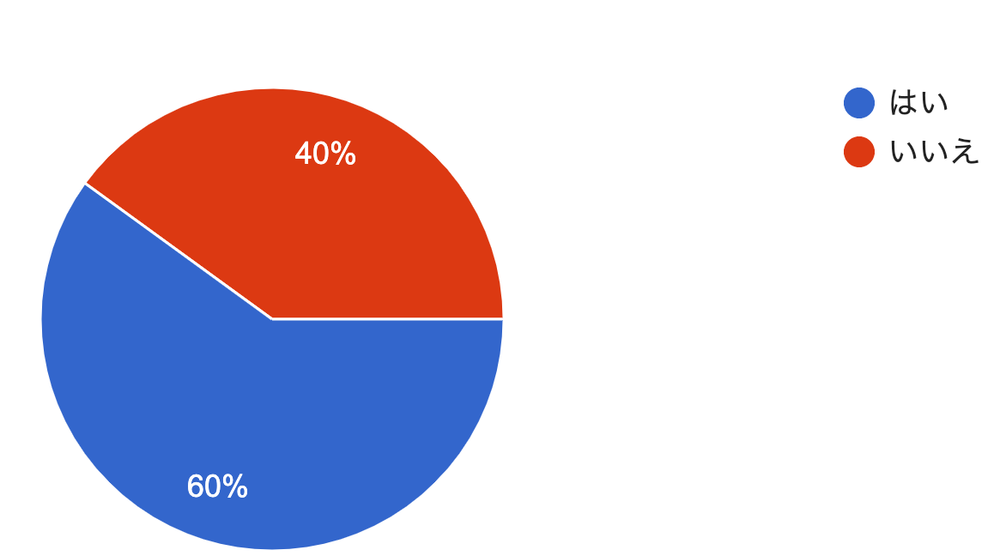
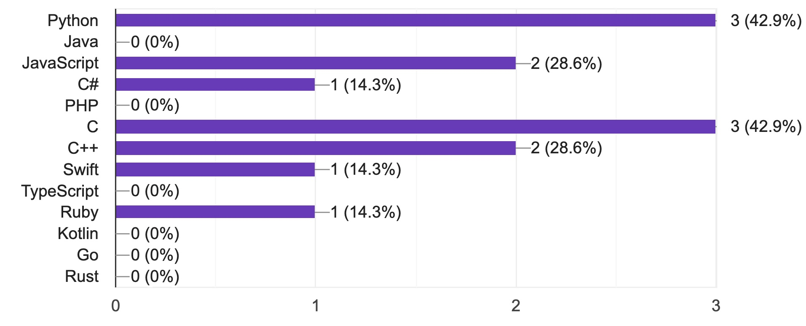
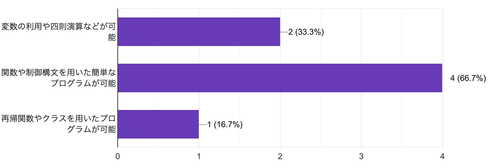
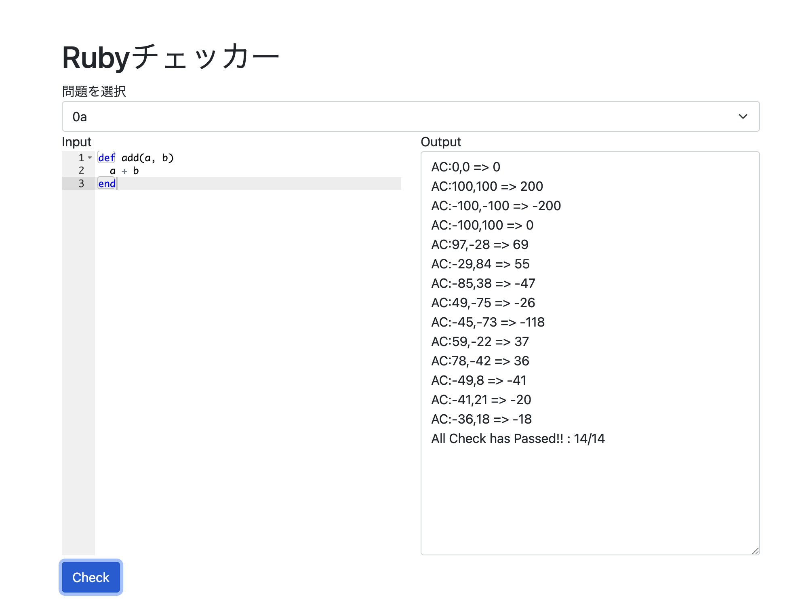

# Ruby講習 第1回

### 工学研究部 新入生向け講習会

22 Void\
2021年4月23日\
<small>I類コンピューターサイエンスプログラム2年</small>

---

# 講習の概要

---

### 講習スケジュール(仮)

| 回 | 日付   | テーマ         |
| - | ---- | ----------- |
| 1 | 4/23 | 簡単な演算と関数    |
| 2 | 5/06 | 制御構文とスコープ   |
| 3 | 5/13 | 配列とデータ構造    |
| 4 | 5/20 | 再帰とオブジェクト指向 |

用事などで参加できない場合でも、 毎回の講習はZoomで録画して配布します また希望があれば別日にも開催します！

---

# 新入生講習の目的

プログラミングや電子工作について知ってもらう

ものづくりを楽しんでもらう

---

# 事前アンケート結果

ご協力ありがとうございました！

---

### プログラミングをした経験はありますか？



---

### どんな言語に触れたことがありますか？



---

### プログラミングスキルを教えて下さい



---

### やりたいことを教えてください

- マイコン制御
- ゲーム
- Webアプリ
- アプリ開発
- 競技プログラミング
- OS開発
- 実用的なアプリ
- タスク管理

---

## 講習の形式

# 内容の説明 + **演習**

説明を聞くよりも実際に手を動かすとより 理解が深まるので演習を重視します

---

## 講義資料とチェッカー

講習サイト：https://rubylect.k1h.dev/lect1

チェッカー：https://rubylect.k1h.dev/checker

---

## 演習問題について

内容に基づいて毎回演習問題を用意します

**講習ではA〜Cの基礎的な問題を解説します**

Rubyを既に習った方や上級者向けに D〜F問題もありまので挑戦してみてください！

### 解けているかはチェッカーで判定します！

---

#### チェッカーの使い方

1. 左側に関数を入力
2. 問題番号を選択
3. Checkを押す
4. **AC**と表示されればOK



---

## 本日の講習の流れ

<div style="text-align:left">

### 1. Rubyについて

### 2. Rubyを触ってみる

### 3. 簡単な数値計算と関数

### 4. 演習+解説

</div>

---

# 1. Rubyについて

---

## まずプログラミングとは何か？

コンピューターに対して命令を記述して実行する

---

## Rubyとは？

- オブジェクト指向プログラミング言語
- まつもとゆきひろ(Matz)により開発
- 長年言語仕様が明文化されておらず、\
  MRI(CRuby)、JRuby、mrubyなど様々な実装がある
- Ruby on Rails, Gosu, DXRuby, GR-Citrusなど\
  Webアプリ開発からゲーム、マイコン制御まで幅広く
- 後期の基礎プログラミング及び演習で使う

---

# Rubyを触ってみる

---

## 環境構築チェック

事前に用意した第0回でA.B.Cのいずれかで構築 PowerShell or ターミナルで`irb`を入力

<hr>

Cの場合やまだ出来ていない場合は

https://mame.github.io/emruby/irb/

などでやってみる

---

## irbとは?

**I**nteraction **R**u**b**y の略称 対話型でRubyで行えることを直接入力して試せる

---

## Hello World!

画面にHello Worldを表示する簡単なプログラム

古来から動作確認などに使われる伝統の儀式

```ruby
irb(main):001:0> puts("Hello World!")
Hello World!
=> nil
```

---

## 解説

```ruby
puts("Hello World!")
```

カッコ内の文字を出力する
"や'で囲われた文字は文字列として扱われる

---

ちなみに、
```ruby
puts "Hello World!"
```
のようにの代わりに空白でもOK

文字を出力する命令は他にもあって、
```ruby
p(オブジェクトを表示)
puts(改行あり)
print(改行なし)
```
ややこしい...

---

# ちょっと休憩

---

# 3. 簡単な数値計算と関数

---
## 変数

```ruby
irb(main):005:0> a=10
=> 10
irb(main):005:0> puts(a)
10
=> nil
```

数学の変数と同じで変数を定義して代入が可能

---
## 変数

```ruby
irb(main):005:0> a=10
=> 10
irb(main):005:0> a=3
=> 3
irb(main):005:0> puts(a)
3
=> nil
```

もう一度代入すると値が書き換わる

---
## 四則演算

```ruby
irb(main):008:0> a=3
=> 3
irb(main):009:0> b=4
=> 4
irb(main):012:0> a+b
=> 12
irb(main):012:0> a-b
=> -1
irb(main):012:0> a*b
=> 12
irb(main):012:0> a/b
=> 0
```
---

## 四則演算

```ruby
irb(main):012:0> 3/4
=> 0
```
のように整数同士の計算は整数になる

```ruby
irb(main):012:0> 3.0/4
=> 0.75
```
のように小数と整数だと結果は小数になる

---
## 四則演算


```ruby
irb(main):016:0> 3/0
(irb):16:in `/': divided by 0 (ZeroDivisionError)
	...
```

ゼロで割るとエラーが発生する(ゼロ除算)

必ず割り算では**0で割られないようにチェック**！

---

## 計算の規則

数学と同じく`*`や`/`が優先される

小数が含まれる計算の結果は小数
整数だけなら整数になる

---

## その他の計算

X**N: XをN乗した結果を出力
```ruby
3**2 => 9
```

X%N: XをNで割った余りを出力
```ruby
3%2 => 1
```

---

## 関数(メソッド)

```irb
irb> def add(a, b)
irb>   return a+b
irb> end
irb> puts(add(3, 4))
=> 7
```

---
## 関数(メソッド)

```irb
def add(a, b)
  return a+b
end
puts(add(3, 4))
```
数学と同じく与えられた変数(引数)に対して
値を返したり命令を実行する

---

# 演習

---

## 0a 動作確認

変数a,bに対してその和を出力する  
関数addを作成せよ

```
制約条件
-100 <= a,b <= 100
a,bはともにすべて整数
```

---
## 0a 動作確認

```ruby
def add(a, b)
  return (a+b)
end
```

---

## 実行環境の用意(ローカル)

適当なフォルダにtest.rbで保存
```bash
irb
irb(main):001:0> load 'add.rb'
=> true
irb(main):002:0> add(3,4)
=> 7
irb(main):003:0> 
```

---

### オンラインで実行する場合

paiza.io
mame.github.io/emruby

```ruby
def add(a, b)
  return (a+b)
end
puts(add(1,3))
```
などのようにして出力で確認

---

#### チェッカーで確認

1. 左側に関数を貼り付け
2. 問題番号0aを選択
3. Checkを押す
4. **AC**と表示されればOK


---

## 演習問題1a

半径がrで高さはhの円錐の体積を求める関数vcornを作成せよ

```
制約条件
0.0<=r<=5.0
0.0<=h<=10.0
円周率はMath::PIを仕様すること
```

<small>Math::PIは変数と同じように使えます</small>

---
## 演習問題1b

m個の苺をn人で分けたときに1人あたり何個もらえて何個余るか出力する関数div(m,n)を作成せよ

```
小数制約条件
0<=m<=100, 0<n<=10
m,nは整数で結果は整数で返す
1人あたりa個もらえて余りがbならば、[a, b]の形で返す
```

<small>

return [a, b] のようにするとOK(これが何かは来週やります)

</small>

---

## 演習問題1c

自然数a,b,cが与えられた時に
$ax^2+bx+c=0 (b^2-4ac\geq 0)$
の解を出力する関数solve(a,b,c)を作成せよ

```
制約条件
0<a,b,c<=100
a,b,cは整数だが出力は小数で行う
2つの解を[a, b]のようにして出力し重解の場合は同じ値を返す
ルートの計算にはMath.sqrt(x)関数を使用してください
```
---

## 演習問題1a

```ruby
def vcorn(r, h)
  return Math::PI*r*r*h/3.0
end
```

r*rの部分はr**2でも大丈夫です

---
## 演習問題1b

```ruby
def div(m, n)
  sol = m/n
  rem = m%n
  return [sol, rem]
end
```

変数を使わなくてもOK
```ruby
return [m/n, m%n]
```

---
## 演習問題1c

```ruby
def solve(a, b, c)
  x1 = (-b+Math.sqrt(b**2-4*a*c))/(2*a)
  x2 = (-b-Math.sqrt(b**2-4*a*c))/(2*a)
  return [x1, x2]
end
```

<small>

Math.sqrt(x)にx<0を入れると
Numerical argument is out of domain
というエラーが出ます

</small>

---

# お疲れさまでした！
次回は5/6 19:00〜です

D問題以上の解答が気になる場合は21ぼいどまで
5/6以降にすべての模範解答を掲載します