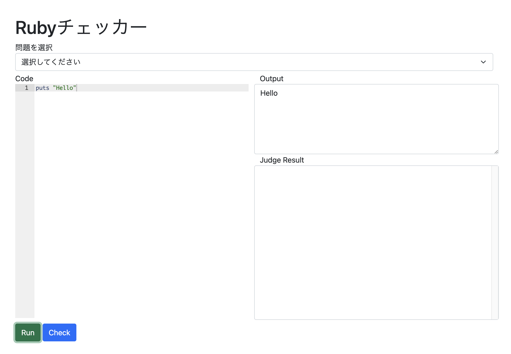

## 第2回 配列と制御構文

# 目次

* Topics
{:toc}

# 演習の環境について

講義中の演習では`irb`を用いて解説を行っていたのですが、そのための環境構築が必要であり環境構築が出来ていない状態で講習が受講できていなかった方もいるかと思います。
配慮が足りずに申し訳ありません。

今回の講習からは基本的にローカルでの環境構築をしなくても演習を行える環境を用意しました。
講習内でもターミナルではなくそちらを使用して説明を行っていきます。

もちろん、従来どおりのターミナルを用いた方法で演習していただいても構いません。

## チェッカーv2の使い方

チェッカー：[Checker v2](/checker)



チェック機能に加えてコード実行機能が追加されました。

同じようにコードを書いて`Run`を押すとコードが実行されます。また、チェックをする際は問題を選択して`Check`ボタンを押してください。

# 先週の復習

先週取り扱った内容は

- Rubyとプログラミングについて
- 変数
- 四則演算
- 関数

の4つでした。

少し早いペースで進めてしまったこともあるかと思うので少し復習。

## Rubyの基本

Rubyでは文字や表示をさせるためには`puts`という命令を使用します。

```ruby
puts("Hello World")
```
のようにすると
```
Hello World
```
と画面に出力されます。

Rubyでは`'文字列'`や`"これも文字列"`のように`"`や`'`で囲んだ内容が文字列として扱われます。

また、putsでは文字列の他にも
```
puts(3)
```
のようにして数字を出力したり、
```
a = 13
puts(a)
```
のようにすると変数の中身を出力することも出来ます。

## 変数

変数は数学における変数と同じです。
```ruby
a = 13
```
のように変数を定義して数値を代入したり、
```ruby
a = 13
a = 0
puts(a) => 0
```

のようにもう一度代入することで値を書き換えることが可能になります。

※ =>は右側の文字列が出力されることを表しています

## 四則演算

`+ - * /`の記号を使うことで四則演算をすることが出来ます。

```ruby
3 + 4 => 7
3 - 4 => -1
3 * 4 => 12
3 / 4 => 0
```

**ただし、整数同士の計算では結果も整数になるので注意が必要です。**

```ruby
3 / 4.0 => 0.75
```
のように、式の中に小数が含まれる場合は結果も小数になります。

また、計算の順序は数学と同じで

```ruby
3 + 4 * 2 => 12
(3+4)*2 => 14
```
のように掛け算・割り算が優先され、括弧でくくると先に計算されます。

その他にも、

```ruby
3%2 => 1 (あまりを求める)
3**2 => 9 (累乗する)
```

といったような演算も可能です。

## 関数

数学の関数と同じように、入力された値に対して何かしらの処理をして値を返すものが関数です。

たとえば、$$f(x)=3x^2+2x+1$$といったような関数をRubyの関数にすると

```ruby
def f(x)
  return 3 * x**2 + 2*x + 1
end
```

のようになります。

関数を定義するときは、`def 関数名(引数)`で始まり`end`で終わるようにします。

Rubyでは関数などの塊を書く場合にはインデントで下げる必要があります。

また、引数は1つではなく2つ以上も使えるので
```ruby
def norm(x, y)
  return Math.sqrt(x**2+y**2)
end
```
といったようなことも可能です。

# 今回の内容

今回の大きな2つのテーマは
- 配列
- 簡単な制御構文(if else for)
です。

配列や制御構文を使いこなすことができると色々と便利にすることが可能になります。
演習問題では、少し実践的な問題も用意しています。
## 配列

配列は複数の変数が連なったもので、例えば似たようなデータを効率的に管理したりすることが可能です。

例えば、温度センサーから取得した一週間分のデータを管理したい場合に変数で全部記録すると
```ruby
data_sun = 13.0
data_mon = 15.0
data_tue = 12.3
data_wed = 42.0
data_thu = 32.0
data_fri = 13.0
data_sat = 21.0
```
のように複数の変数を定義する必要があり、たとえばこれらの平均を求めるときにも
```ruby
(data_sun+data_mon+data_tue+data_wed+data_thu+data_fri+data_sat)/7.0
```
のように非常に長く面倒なコードになってしまいます。

そこで配列を利用すると、
```ruby
temp_week = [13.0, 15.0, 12.3, 42.0, 32.0, 13.0, 21.0]
```
のようにして簡単に記録することが可能になります。

配列のイメージとしては、

|  番地  |  0  |  1  |  2  |  3  |  4  |  5  | 6 |
| ----  | ----  | ----  | ----  | ----  | ----  | ----  |
|  要素  |  13.0  |  15.0  |  12.3  |  42.0  |  32.0  |  13.0  |  21.0  |

のように数字がついた箱が順番に並んでおり、その中に数が格納されているといったようなイメージです。

このようにRubyでは`変数名[]`で値を囲むことで配列を定義でき、`変数名[n]`のようにすると`[n]`番目の要素にアクセス可能にできます。

注意ポイントとしては、**配列の番地のカウントは`0`から始まります**。

よくある間違えで、`temp_week[1]`のようにして1番目の要素を取得しようとして2番目の要素が出力されてしまうことがあります。

`n`は配列の添字といいます。

```ruby
temp_week[0] => 13.0
```
のようにすると値を取得することが可能になります。

実際にいくつか配列の例をご紹介します。

```ruby
stations = ["千歳烏山", "仙川", "つつじヶ丘", "調布"] #文字列を載せる
matrix = [[1,2,3],[4,5,6],[7,8,9]] #配列の中に配列を入れることも可能です
```

配列を配列の中に入れた場合には、
```ruby
matrix = [[1,2,3],[4,5,6],[7,8,9]]
matrix[0] => [1,2,3]
matrix[0][1] => 1
```
のように配列を塊として捉えて、配列の中に配列にアクセスすることが可能になります。

### 配列を使う際の注意点

配列を使う際はデータの長さに注意しておく必要があります。

例えば、
```ruby
data = [1, 2, 3]
```
のような配列に含まれる変数の数(配列の長さ)が`3`であるような配列`data`があるとします。

このときもし`data[3]`のように存在しない値にアクセスしようとすると
`data[3] => nil`のようになってしまい、`nil`が処理に含まれることで何かしらのエラーが発生する場合もあるので注意が必要です。

### (おまけ)データを動的に追加するには

もしすでに定義した配列に新しい要素を追加したい場合には、

```ruby
data = [1, 2, 3]
data << 4
p(data) => [1, 2, 3, 4]
```

のようにすると配列の末尾に値を追加することが可能になります。

また、配列の途中に入れようとする場合には`insert`という命令もあり、
```ruby
data = [1, 2, 3]
data.insert(1, 4)
p(data) => [4, 1, 2, 3]
```
`配列.insert(挿入位置, 挿入する要素)`のように使えます。ちなみに、この場合の挿入する位置は、先頭が1の普通の場合と同じなので注意が必要です。

ちなみに、配列を表示させるときは`p`を使うと良い感じに表示されるのでおすすめです。
## 制御構文

制御構文はプログラミングの基礎となる部分で、分岐、繰り返しといった手続きの実行順序を制御することが可能になります。

**必ずプログラムが終了するようにしてください。**  
**無限ループした場合はタブを閉じて開き直してください。**

### 条件分岐

Rubyではif文と言われる構文を用いることによって、条件に応じて分岐をすることが可能です。

では具体的な例を紹介します。

```ruby
def isPlus(num)
  if num > 0
    return true
  else
    return false
  end
end
```

この関数を実際に動かしてみると、

```ruby
isPlus(3) => true
isPlus(-4) => false
```

のように、正の数ならば`true`でそれ以外ならば`false`と表示されることが分かります。

`if`文は

```ruby
if 条件式 then
  処理
end
```

のようにして使うことができます。また、`else`や`elsif`と合わせて組み合わせると


```ruby
if 条件式 then
  処理
elsif 条件式 then
  処理
else
  処理
end
```

#### 条件式

条件式は演算子という記号を用いて記述します。

演算子の種類には大きく2つあり、2つの変数の関係を示す比較演算子と、複数の条件の組み合わせからなる関係演算子があります。

##### 関係演算子の例

|演算子|意味|用例|
|---|---|---|
|==|等しい|a = b|
|!=|等しくない|a != b|
|>|より大きい|a > b|
|<|より小さい|a < b |
|>=|以上|a >= b|
|<=|以下| a <= b|

ちなみに、`==`の他にも`===`もありますが`===`の方が厳密です。

##### 論理演算子の例

|演算子|意味|用例|
|---|---|---|
|&&|かつ|(a > 0) && (b > 0)|
|\|\||または|(a > 0) \|\| (b > 0)|
|!|否定|!(a > 0)|


こうして条件を用いて次のような関数を作ってみます。

```ruby
def getSign(num)
  if num > 0
    return "Plus"
  elsif num == 0
    return "Zero"
  else
    return "Minus"
  end
end
```

実行してみると
```
getSign(3) => "Plus"
getSign(0) => "Zero"
getSIgn(-4) => "Minus"
```
のように符号の正負を取得できています。

`elsif`の書き方ですが、言語によって謎の個性を出しているため
```
C,C++: else if
Ruby: elsif
Python: elif
```
のように微妙に違うので注意が必要です。

### 繰り返し

繰り返しは先程の配列を処理する際にとても便利です。

Rubyでは繰り返しをする方法が多くあり、全部説明するのは難しいので今回はシンプルなものだけを紹介します。その他の構文に関しては次回説明します。

シンプルな繰り返し処理としては、`for`を用いた記法を紹介します。

```ruby
for i in 1..5 do
  puts(i)
end
```
このコードを実行すると、
```
1
2
3
4
5
```
と1から5まで打ち出されます。
`a..b`のように書くと、aからbまで順番に1づつ要素として取り出します。取り出した要素は変数`i`に代入されていきます。

また、`a..b..c`とすると、aからbまでcづつ増えていくとゆうようなこともできます。

ちなみに同じようなことを実行するだけなら、

```ruby
5.times do |i|
  puts(i)
end
```

このコードを実行すると、
```
0
1
2
3
4
```
のように合計で囲まれた中身が合計5回実行されるようなコードも作ることが可能です。

さて、for文を使った具体的な例を見てみましょう。

さきほどの配列における1週間の平均気温を求める場合には、

```ruby
temp_week = [13.0, 15.0, 12.3, 42.0, 32.0, 13.0, 21.0]
temp_sum = 0.0
for temp in temp_week do
  temp_sum += temp
end
temp_avg = temp_sum / temp_week.size
puts(temp_avg) => 21.185714285714287
```

のようにしてあげると簡単に求めることができます。`temp_week.size`は配列の要素数を取得する記法です。

これの良い部分は、要素数によらず自動的に求めることができる点です。

また、先程のif文と組み合わせてあげると有名なFizzBuzzという問題を解くことができます。

このルールは単純で、1から順に数を数え上げていき、3の倍数なら「Fizz」、5の倍数なら「Buzz」、両方の倍数（15の倍数）なら「Fizz Buzz」、いずれでもなければその数を出力するものです。

```ruby
def FizzBuzz()
  for i in 1..30
      if i%3==0 && i%5==0
          puts "FizzBuzz"
      elsif i%3==0
          puts "Fizz"
      elsif i%5==0
          puts "Buzz"
      else
          puts i
      end
  end
end
FizzBuzz()
```

実行してみると、

```
1
2
Fizz
4
Buzz
Fizz
7
8
Fizz
Buzz
11
Fizz
13
14
...
```

のようにいい感じに出力されていると思います。
この他にもfor文とif-else文、配列を組み合わせる色々な事ができるので、是非演習問題に挑戦してみてください。

# 演習
## 演習問題2a

4キロごとの営業キロに応じた運賃表が与えられます。営業キロがx(km)として与えられた時、運賃を出力する関数`getFare(x)`を作成せよ。

```
制約
xは0以上30以下の実数として与えられる。
運賃表は以下に示し、0キロ~31キロまである。
なお、0~3は0キロ以上4キロ未満であることを示している。
```

運賃表

| 営業キロ | 運賃(円) |
| --- | --- |
| 0~3 | 150 |
| 4~7 | 190 |
| 8~11 | 200 |
| 12~15 | 240 |
| 16~19 | 330 |
| 20~23 | 420 |
| 24~27 | 510 |
| 28~31 | 590 |

```ruby
getFare(4.2) => 190
getFare(12.4) => 240
```

ヒント: 規則性に注目するととてもシンプルにプログラムを書けます

<details markdown=block><summary><b>サンプルコード(押して開く)</b></summary>

```ruby
def getFee(x)
  data = [150,190,200,240,330,420,510,590]
  return data[x/4]
end
```

</details>

## 演習問題2b

ある整数`n`が与えられた時、その数が素数かどうかを判定する関数`isPrimes(n)`を作成せよ。
なお、素数の場合は`true`を返し、素数でない場合は`false`を返す。

```
制約
nは0以上100以下の整数
その数が素数かどうかわからないときは、素数の定義から考えてください
```

ヒント: 工夫すると計算する回数をへらすことができるので2fにも是非挑戦してみてください

入出力例
```
isPrime(5) => true
isPrime(28) => false
```

<details markdown=block><summary><b>サンプルコード(押して開く)</b></summary>

```ruby
def isPrime(n)
  if n < 2
    return false
  end
  for i in 2..(n-1)
    if n % i == 0
      return false
    end
  end
  return true
end
```

</details>


## 演習問題2c

20人のクラスで100点満点の複素関数論のテストを実施しました。その結果が配列として与えられた時、標準偏差を求める関数`std(scores)`を作成せよ。

```
制約
すべての値は0以上100以下の整数で与えられる
要素数は最小で10以上、最大で30以下である
nは与えられる配列の要素数と一致しているため、
配列をscoresとしたときn=scores.sizeとして取得できる
```

ヒント

標準偏差$$s$$は各データの値を$$x_i$$、データの総数を$$n$$、データの平均を$$\overline{x}$$としたとき次式で求められる。

$$
s = \sqrt{\frac{1}{n} \sum_{i=1}^n (x_i-\overline{x})^2}
$$

入出力例
```
stddevia([0, 100, 4, 86, 1, 34]) => 41.0954174249798
```

<details markdown=block><summary><b>サンプルコード(押して開く)</b></summary>

```ruby
def std(scores)
  sum = 0.0
  n = scores.size
  for score in scores do
    sum += score
  end
  avg = sum / n
  devia = 0.0
  sum_temp = 0.0
  for score in scores
    sum_temp += (score - avg) ** 2
  end
  return Math.sqrt(sum_temp / n).round(2)
end
```

</details>


### 以下上級者向け問題

## 演習問題2d

整数nが与えられた時、2からnまですべての素数を配列として返す関数`getPrimes(max)`を作成せよ。

```
制約
nは2以上100以下です。
```

ヒント: もっと高速なアルゴリズムを考えてみるとおすすめです

入出力例
```
getPrimes(5) => [2, 3, 5]
```

<details markdown=block><summary><b>サンプルコード(押して開く)</b></summary>

```ruby
def getPrimes(max)
  list = (2..max).to_a
  prime_list = []
  sqrt = Math.sqrt(max).floor

  while val = list.shift
    prime_list << val
    if val > sqrt
      break
    end
    list.delete_if{|num| num % val == 0}
  end
  return prime_list.concat(list)
end
```

</details>

## 演習問題2e

以下に列車の運賃表が与えられます。この列車では、目的地までのきっぷを1枚で買うよりも分割して買ったほうが安くなる場合があります。

営業キロ`x`が与えられた時、きっぷ分割を使った最安の運賃`minFee(x)`を出力する関数を求める。

| 営業キロ | 片道運賃 |
|----------|----------|
| 0～3   | 140    |
| ４～7   | 190    |
| 8～11   | 200    |
| 12～15   | 240    |
| 16～19   | 320    |
| 20～23   | 410    |
| 24～27   | 500    |
| 28～31   | 580    |
| 32～35   | 670    |
| 36～39   | 760    |
| 40～43   | 840    |
| 44～47   | 970    |
| 48～51   | 1,140  |
| 52～55   | 1,320  |
| 56～59 | 1,490  |
| 60～63  | 1,660  |

```
制約
xは1以上60以下です
分割できる最大の枚数は3枚です
```

入出力例
```
minFee(60) => 1050
```

<details markdown=block><summary><b>サンプルコード(押して開く)</b></summary>

```ruby
def minFee(x)
  min = 99999
  fees = [140,190,200,240,320,410,500,580,670,760,840,970,1140,1320,1490,1660]
  for i in 0..x do
    for j in 0..(x-i) do
      a = fees[i/4]
      b = fees[j/4]
      c = fees[(x-i-j)/4]
      a = 0 if i == 0
      b = 0 if j == 0
      min = [a+b+c,min].min
    end
  end
  return min
end
```

</details>

## 演習問題2f

演習問題2bについて、`x`が与えられたときに素数か判定するプログラム`isPrime(x)`を作ります。
ここで、500回isPrimeを呼び出したときに合計で`500ms`未満で実行が完了するように改良してください。

```
制約
xは2以上90000以下です
```

<details markdown=block><summary><b>サンプルコード(押して開く)</b></summary>

```ruby
def isPrime(n)
  if n < 2
    return false
  end
  for i in 2..Math.sqrt(n)
    if n % i == 0
      return false
    end
  end
  return true
end
```

</details>