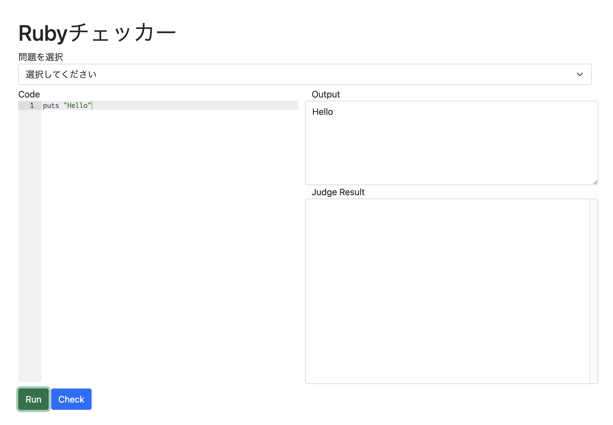

# Ruby講習 第2回

### 工学研究部 新入生向け講習会

21 Void\
2022年5月6日\
<small>I類コンピューターサイエンスプログラム2年</small>

---

### 講習スケジュール(v2)

| 回 | 日付   | テーマ         |
| - | ---- | ----------- |
| 1 | 4/23 | 簡単な演算と関数    |
| **2** | **5/06** | **配列と簡単な制御構文**   |
| 3 | 5/13 | 複雑な制御構文と再帰関数    |
| 4 | 5/20 | オブジェクト指向と何か |

前回の講習の録画と資料はDiscordにて配布中

---

## 講義資料とチェッカー

講習サイト：https://rubylect.k1h.dev/lect2

チェッカー：https://rubylect.k1h.dev/checker

---

# 第2回 配列と制御構文

---

# 目次

- 前回の復習
- 配列
- 簡単な制御構文

---

# 演習の環境について

`irb`ではなくブラウザで行います

環境構築が出来ていない状態で講習が
受講できていない方もいたため

---

チェッカーv2のUsage



- コードを書いてRunを押すとコードが実行されます
- チェックをする際は問題を選択してCheckボタンを押してください

---

# 先週の復習

先週取り扱った内容は

- Rubyとプログラミングについて
- 変数
- 四則演算
- 関数

の4つでした。

---

少し早いペースで進めてしまった
こともあるかと思うので少し復習

---

# Rubyの基本

```ruby
puts("Hello World")
```
のようにすると
```
Hello World
```
と画面に出力される

---

`'文字列'`や`"これも文字列"`

---

```
puts(3)
```

```
a = 13
puts(a) => 13
```

---

## 変数

```ruby
a = 13
a = 0
puts(a) => 0
```
---

## 四則演算

`+ - * /`の記号を使うことで
四則演算をすることが出来る

```ruby
3 + 4 => 7
3 - 4 => -1
3 * 4 => 12
3 / 4 => 0
```

---

**ただし、整数同士の計算では結果も整数になるので注意が必要です。**

```ruby
3 / 4.0 => 0.75
```
のように、式の中に小数が含まれる場合は結果も小数になります。

---

また、計算の順序は数学と同じ

```ruby
3 + 4 * 2 => 11
(3+4)*2 => 14
```
---

その他にも、

```ruby
3%2 => 1 (あまりを求める)
3**2 => 9 (累乗する)
```

といったような演算も可能

---

## 関数

$f(x)=3x^2+2x+1$

```ruby
def f(x)
  return 3 * x**2 + 2*x + 1
end
```

---

`def 関数名(引数)`
で始まり
`end`
で終わる

Rubyでは関数などの塊を書く場合にはインデントで下げる必要

---

また、引数は1つではなく2つ以上も使えるので
```ruby
def norm(x, y)
  return Math.sqrt(x**2+y**2)
end
```
といったようなことも可能です。

---

# 今回の内容

今回の大きな2つのテーマは
- 配列
- 簡単な制御構文(if else for)

配列や制御構文を使いこなすことができると
色々と便利にすることが可能に

---

## 配列


配列は複数の変数が連なったもので
例えば似たようなデータを効率的に管理

---

例えば、温度センサーから取得した一週間分のデータを管理したい場合に変数で全部記録すると

```ruby
data_sun = 13.0
data_mon = 15.0
data_tue = 12.3
data_wed = 42.0
data_thu = 32.0
data_fri = 13.0
data_sat = 21.0
```
のように複数の変数を定義する必要があり、たとえばこれらの平均を求めるときにも

---

```ruby
(data_sun+
data_mon+
data_tue+
data_wed+
data_thu+
data_fri+
data_sat)/7.0
```
のように非常に長く面倒なコードに！

---

そこで配列を利用すると、
```ruby
temp_week = 
[13.0, 15.0, 12.3, 42.0, 32.0, 13.0, 21.0]
```

簡単に！

---

配列のイメージ

| 番地 | 0    | 1    | 2    | 3    | 4    | 5    | 6    |
|------|------|------|------|------|------|------|------|
| 要素 | 13.0 | 15.0 | 12.3 | 42.0 | 32.0 | 13.0 | 21.0 |


---

このようにRubyでは`変数名[]`で値を囲むことで配列を定義でき、`変数名[n]`のようにすると`[n]`番目の要素にアクセス可能

注意ポイントとしては、**配列の番地のカウントは`0`から始まります**。

---

よくある間違え

`temp_week[1]`のようにして1番目の要素を取得しようとして2番目の要素が出力?

`n`は配列の添字といいます。

```ruby
temp_week[0] => 13.0
```
のようにすると値を取得することが可能

---

```ruby
stations = 
["千歳烏山", "仙川", "つつじヶ丘", "調布"] 
#文字列を載せる
matrix = 
[[1,2,3],[4,5,6],[7,8,9]] 
#配列の中に配列を入れることも可能です
```

---

配列を配列の中に入れた場合には、
```ruby
matrix = [[1,2,3],[4,5,6],[7,8,9]]
matrix[0] => [1,2,3]
matrix[0][1] => 1
```
のように配列を塊として捉える

---

### 配列を使う際の注意点

配列を使う際はデータの長さに注意

```ruby
data = [1, 2, 3]
data[3] => nil
```

---

### (おまけ)データを動的に追加するには

もしすでに定義した配列に
新しい要素を追加したい場合には、

```ruby
data = [1, 2, 3]
data << 4
p(data) => [1, 2, 3, 4]
```

---

```ruby
data = [1, 2, 3]
data.insert(1, 4)
p(data) => [4, 1, 2, 3]
```
配列.insert(挿入位置, 挿入する要素)

のように使えます。

---

配列を表示させるときは`p`を使うと良い感じに表示されるのでおすすめ

---

## 制御構文

制御構文はプログラミングの基礎となる部分
分岐、繰り返しといった
手続きの実行順序を制御可能

---

**必ずプログラムが終了するようにしてください**  
**無限ループした場合はタブを閉じて開き直してください**

---

### 条件分岐

Rubyではif文と言われる構文を用いることによって、条件に応じて分岐をすることが可能

---

では具体的な例を紹介します。

```ruby
def isPlus(num)
  if num > 0
    return true
  else
    return false
  end
end
```

---

この関数を実際に動かしてみると、

```ruby
isPlus(3) => true
isPlus(-4) => false
```

のように、正の数ならば`true`でそれ以外ならば`false`と表示されることが分かります。

---

`if`文は

```ruby
if 条件式 then
  処理
end
```

のようにして使うことができます。また、`else`や`elsif`と合わせて組み合わせると

---


```ruby
if 条件式 then
  処理
elsif 条件式 then
  処理
else
  処理
end
```

---

# 条件式

---

##### 関係演算子の例

|演算子|意味|用例|
|---|---|---|
|==|等しい|a = b|
|!=|等しくない|a != b|
|>|より大きい|a > b|
|<|より小さい|a < b |
|>=|以上|a >= b|
|<=|以下| a <= b|

ちなみに`===`の方が厳密

---

##### 論理演算子の例

|演算子|意味|用例|
|---|---|---|
|&&|かつ|(a > 0) && (b > 0)|
|\|\||または|(a > 0) \|\| (b > 0)|
|!|否定|!(a > 0)|

---

次のような関数を作ってみます。

```ruby
def getSign(num)
  if num > 0
    return "Plus"
  elsif num == 0
    return "Zero"
  else
    return "Minus"
  end
end
```

---

実行してみると
```ruby
getSign(3) => "Plus"
getSign(0) => "Zero"
getSIgn(-4) => "Minus"
```
のように符号の正負を取得できています。

---

`elsif`の書き方
```
C,C++: else if
Ruby: elsif
Python: elif
```
のように微妙に違うので注意が必要

---

### 繰り返し

繰り返しは先程の配列を処理する際にとても便利

---

```ruby
for i in 1..5 do
  puts(i)
end
```

---

このコードを実行すると、
```
1
2
3
4
5
```

---

`a..b`のように書くと、aからbまで順番に1づつ要素として取り出します。取り出した要素は変数`i`に代入

また、`a..b..c`とすると、aからbまでcづつ増えていくとゆうようなこともできます。

---

ちなみに同じようなことを実行するだけなら、

```ruby
5.times do |i|
  puts(i)
end
```

---

このコードを実行すると、
```
0
1
2
3
4
```

---

のように合計で囲まれた中身が合計5回実行されるようなコードも作ることが可能です。

---

さて、for文を使った具体的な例を見てみましょう。

さきほどの配列における1週間の平均気温を求める場合には、

---

```ruby
temp_week = [13.0, 15.0, 12.3, 42.0, 32.0, 13.0, 21.0]
temp_sum = 0.0
for temp in temp_week do
  temp_sum += temp
end
temp_avg = temp_sum / temp_week.size
puts(temp_avg) => 21.185714285714287
```

のようにしてあげると簡単に求めることができます。`temp_week.size`は配列の要素数を取得する記法

----

### FizzBuzz!

```ruby
def FizzBuzz()
  for i in 1..30
      if i%3==0 && i%5==0
          puts "FizzBuzz"
      elsif i%3==0
          puts "Fizz"
      elsif i%5==0
          puts "Buzz"
      else
          puts i
      end
  end
end
FizzBuzz()
```

---

```
1
2
Fizz
4
Buzz
Fizz
7
8
Fizz
Buzz
11
Fizz
13
14
...
```

---

# 演習

---

## 演習問題2a

4キロごとの営業キロに応じた運賃表が与えられます。営業キロがx(km)として与えられた時、運賃を出力する関数getFare(x)を作成せよ。

```
制約
xは0以上30以下の実数として与えられる。
運賃表は以下に示し、0キロ~31キロまである。
なお、0~3は0キロ以上4キロ未満であることを示している。
```

---

運賃表

| 営業キロ | 運賃(円) |
| --- | --- |
| 0~3 | 150 |
| 4~7 | 190 |
| 8~9 | 200 |
| 12~15 | 240 |
| 16~19 | 330 |
| 20~23 | 420 |
| 24~27 | 510 |
| 28~31 | 590 |

---

```ruby
getFare(4.2) => 190
getFare(12.4) => 240
```

ヒント: 規則性に注目するととてもシンプルにプログラムを書けます

---

## 演習問題2b

ある整数nが与えられた時、その数が素数かどうかを判定する関数isPrimse(n)を作成せよ。
なお、素数の場合はtrueを返し、素数でない場合はfalseを返す。

---

```
制約
nは0以上100以下の整数
その数が素数かどうかわからないときは
素数の定義から考えてください
```

---

ヒント: 工夫すると計算する回数をへらすことができるので挑戦してみてください

入出力例
```
isPrime(5) => true
isPrime(28) => false
```

---

## 演習問題2c

20人のクラスで100点満点の複素関数論のテストを実施しました。その結果が配列として与えられた時、標準偏差を求める関数`std(scores)`を作成せよ。

---

```
制約
すべての値は0以上100以下の整数で与えられる
要素数は最小で10以上、最大で30以下である
nは与えられる配列の要素数と一致しているため、
配列をscoresとしたときn=scores.sizeとして取得できる
```

---

ヒント

標準偏差$s$は各データの値を$x_i$、データの総数を$n$、データの平均を$\overline{x}$としたとき次式で求められる。

$
s = \sqrt{\frac{1}{n} \sum_{i=1}^n (x_i-\overline{x})^2}
$

---

入出力例
```
stddevia([0, 100, 4, 86, 1, 34]) => 41.0954174249798
```

---

# お疲れさまでした！
次回は5/13 19:00〜です