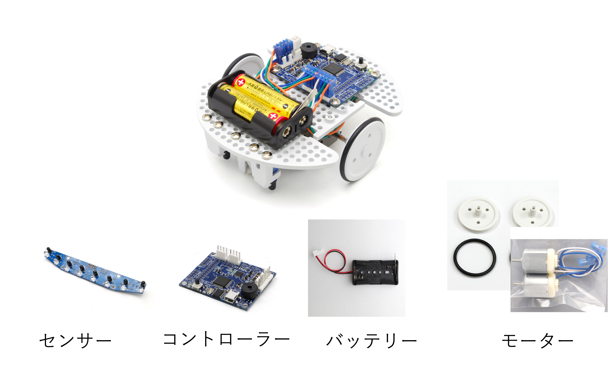

# Ruby講習 第4回

### 工学研究部 新入生向け講習会

21 Void\
2022年5月20日\
<small>I類コンピューターサイエンスプログラム2年</small>

---

### 講習スケジュール(v2)

| 回 | 日付   | テーマ         |
| - | ---- | ----------- |
| 1 | 4/23 | 簡単な演算と関数    |
| 2 | 5/06 |*配列と簡単な制御構文   |
| 3 | 5/13 | 複雑な制御構文と再帰関数    |
| 4 | **5/20** | **スコープ、オブジェクト指向と読みやすいコード** |

前回の講習の録画と資料はDiscordにて配布中

---

# 先週の復習

前回の後半の内容を
すべて理解していなくても大丈夫

---
# 複雑な制御構文

---

### Case文

```ruby
def getClass(age)
  if 0..2
    "幼児"
  when 3..6
    "小児"
  when 7..12
    "子供"
  when 13..18
    "若者"
  else
    "大人"
  end
end
```

---

`case A`としたとき`A`とwhenで指定された部分が一致する処理を行す

`else`はどの条件にも当てはまらないときに呼ばれ

1つの値に対して複数の条件分岐をする場合に完結に書くことができる

---
### While文

while文は条件を満たす間は処理を行う処理。

```ruby
def countdown(n)
  while n > 0 do
    puts n
    n = n -1
  end
end
```
---

のような処理をすると、`n > 0`を満たす間は`n = n - 1`をするので、nから順にカウントダウンされていきます。

---
#### each文

```ruby
data = [1, 2, 3]
sumA = 0.0
sumB = 0.0
for num in data do
  sumA += num
end
data.each do |num|
  sumB += num
end
```

のように配列から順番に要素を取り出して処理をすることが可能です。

---

#### breakとnext

`break`はループを強制的に抜ける命令で

```ruby
10.times do |i|
  break if i > 5
  puts i
end
```

---

このように、`i`が5より大きくなると`break`が呼び出されて`for`文から強制的に抜けるので、

```
0
1
2
3
4
5
```
となります。

---

また、`next`文を使うと特定の条件で処理をスキップすることもでき、

```ruby
10.times do |i|
  next if i % 2 == 0
  puts i
end
```

のようにすると、`i`が2の倍数のときに`next`が呼び出されて処理がスキップされます。

---

つまりは、

```
1
3
5
7
9
```

のように奇数だけが出力されるようになります。

---

## 修飾子

`if`や`while`などの文は

```ruby
def fac(n)
  return 1 if n == 0
  return n * fac(n-1)
end
```

のように、`処理 if 条件`などのようにすると1行で書くことが可能。

---

## 再帰関数

```ruby
def fac(n)
  return 1 if n == 0
  return n * fac(n-1)
end
```

のようなコードが有る場合に、例えば、`n=3`を入れた時の動作を見てみると

---


```
fac(3) => 3 * fac(2)
fac(2) => 2 * fac(1)
fac(1) => 1
```

---

順番に代入してみると、

```
fac(3) => 3 * 2 * 1 = 6
```

となります。

---

このように関数の中で関数を呼び出すことが可能。

- 再帰関数を使うと漸化式などをそもまま実装

- 繰り返しで書くよりも完結に

関数を呼び出す回数が多くなりすぎるとエラーが起きるので注意

---

再帰関数を使いこなせると色々なアルゴリズムを実装できる

キーワード
- 動的計画法(メモ化再帰)
- 幅優先探索
- 関数型プログラミング

沼にハマりたい人は是非

---
# スコープ

変数にはいくつか種類があった。

- **ローカル変数** (今までこれを使ってた)
- インスタンス変数
- クラス変数
- グローバル変数

---

```ruby
name = "Void"

def greet(name)
  script =  "Hello!" + name + "!"
  puts(script)
end

greet("Void")
puts(script)
```

---

これを実行すると、
```
Hello!Void!
Error: eval:9:in `<main>': undefined local variable or method `script' for main:Object (NameError)
```
のようにエラーが発生する。

関数の中で定義された変数は関数のみで有効。

スコープは、**変数の有効範囲**のこと。

---

## グローバル変数

```ruby
name = "Void"

def greet(name)
  $script =  "Hello!" + name + "!"
  puts($script)
end

greet("Void")
puts($script)
```

---

これだと、
```
Hello!Void!
Hello!Void!
```
のように正しく表示される。

---

変数の先頭に、`$`をつけて`$script`あげると**グローバル変数**と呼ばれるものになる。

**グローバル変数**のスコープ(有効範囲)はプログラム全体なので、どこからでも参照できる。

---

# オブジェクト指向

プログラミング言語にはいくつか種類がある。

- 手続き型言語(C言語やBASICなど)
- オブジェクト指向言語(**Ruby**やPythonなど)
- 関数型言語(GoやHaskellなど)

この中でも、**Ruby**はオブジェクト指向という考え方に基づいた言語になっている

---

オブジェクト指向の重要な3つの概念は、

- カプセル化(隠蔽)
- 継承
- ポリモーフィズム

今回は雰囲気だけ。

---

プログラムではクラスと呼ばれる関数やデータをまとめたものを扱す

例えばラインをトレースするロボットを制御

---



---

## カプセル化

普通にモーターを制御する場合には、

制御する側はそんなハードウェアのことなんて気にしたくない

モーターをどっちに回すのかと速度を指定すれば勝手にモーターが回ってくれれば良い

---

モータードライバを変更するたびに変更するの面倒ですよね。
一回、作ったら他のロボットでも使いまわす

内部の処理を`ブラックボックス化`してあげることをカプセル化

---

## 継承

車の「直進」「止まる」「曲がる」といったいったようなものを実装するときに、それぞれでまたモーターを制御する設定を書くのは面倒

基本的な設計図を用意して他の必要な部分はそれぞれカスタマイズ

---

```ruby
class ClassName
def method_name(arg1,arg2,...)
  処理
end

instance = ClassName.new()
instanace.medhot_name()
```

---

```ruby
class Motor
  def stop()
    puts "Stop"
  end
  def move(speed)
    puts "MOVE #{speed}"
  end
end

rightMotor = Motor.new
rightMotor.move(1.0)
rightMotor.stop()
```

---

実行すると、
```
MOVE 1.0
Stop
```

---

サーボモータ(角度をしてできるモーター)を追加してみる。

---

```ruby
class Motor
  def stop()
    puts "Stop"
  end
  def move(speed)
    puts "MOVE #{speed}"
  end
end
class Servo < Motor
  def moveDegree(degree)
    puts "MOVEDEG #{degree}"
  end
end
rightMotor = Servo.new
rightMotor.moveDegree(30)
rightMotor.stop()
```

---

これを実行すると、
```
MOVEDEG 30
Stop
```
のように、Motorクラスに対して機能を追加しているような感じ

---

オブジェクト指向は、実際にコードを試行錯誤してみると良い設計や機能をつかめるはず

---

# 読みやすいコード

1人でコードを書いているだけならいいが
チーム開発などでは他の人が読めるコードを書くことが必要になる

特にぐちゃぐちゃなコードを書いてしまうと
のちのちの自分もわけがわからなくなってしまう

---
## 変数・関数名

変数名を定義するときに
適当な名前をつけていませんか?

例えば、次のようなうるう年か
判定する関数があったとします。
ここでは仮に
2022~2027までの5年間を判定します。

---

```ruby
def uruudoshi(toshi)
  if toshi == 2022 then
    return false
  elsif toshi == 2023 then
    return false
  elsif toshi == 2024 then
    return true
  elsif toshi == 2025 then
    return false
  elsif toshi == 2026 then
    return false
  elsif toshi == 2027 then
    return false
  end
end
```

---

```ruby
def うるう年かどうか(年)
  if 年 == 2022 then
    return false
  elsif 年 == 2023 then
    return false
  elsif 年 == 2024 then
    return true
  elsif 年 == 2025 then
    return false
  elsif 年 == 2026 then
    return false
  elsif 年 == 2027 then
    return false
  end
end
```

---

変数名や関数名をつける時のポイント

- その名前を見ただけで、何を表す変数、関数なのかすぐに理解できるようにする
- 基本的に英語でつける
[このサイト](https://codic.jp/engine)とか便利
- 汎用的な言葉を避けて分かりやすく

---

既存のライブラリなどを参考にすると良いかも。

あとは、命名規則を統一すると良いです。

- camelCase (単語の先頭を大文字)
- snake_case (単語の間をアンダーバー)
- kebab-case (単語の間をハイフン)

---

例えば、今回の場合だと

```ruby
# Rubyの場合true/falseを返す関数は?、破壊的な関数は!をつける慣習
def isLeapYear?
  if n % 4 != 0
    puts false
  elsif n % 100 == 0 && n % 400 !=0
    puts true
  else
    puts true
  end
end
```

のように実装できます。

---
## 関数

関数はなるべく機能ごとに簡単に実装します。

もし、長くなりそうな場合や使い回すことができそうな場合は関数にします。

---

## コメントアウト

コードを書くときに適切にコメントアウトを残しておくと、他の人が読んだときや自分が読んだときに役に立ちます。

---

コードを読んでみると面白い。

```ruby
# これは魔法。触っちゃダメ。
# 誰もコメントを読んでくれない！
# THANK YOU MARIO! BUT OUR PRINCESS IS IN ANOTHER CASTLE!
# TODO: もう全部消す
# これ書いた奴バカじゃねーの…全然動かねーよ！
```

---

なんでもかんでもコメントするよりは、考えたロジックなどパット見ではわからないことを書く。場合にもよるが。

---

```ruby
def getPrimeList(max)
  list = (2..max).to_a
  #2からmaxまでの配列(なくても良いかも)
  prime_list = []
  sqrt = Math.sqrt(max).floor
  # 倍数を消す(エラトステネスの篩)
  while val = list.shift
    prime_list << val
    if val > sqrt
      break
    end
    list.delete_if{|num| num % val == 0}
  end
  return prime_list.concat(list)
end
```
---
# 演習

今回の扱った内容は少し難しいため演習問題は
基本的にこれまでの内容の応用です

---

# 演習問題4a

---

2Dゲーム開発者のあなたは円と任意の壁との当たり判定を実装したいと思っています。

ここで壁は直線であり$ax+by+c=0$で与えられます。また、円の中心座標$(x_0, y_0)$であり半径は$r$で与えられます。

このとき、円と壁が接触しているか判定する関数
`isTouched(a,b,c,x0,y0,r)`
を作成せよ。


---
ただし、壁抜けを防止するために接触の判定には`1.0`の幅をもたせる。

---

```
制約
すべての値は整数として与えられる
```

$$
\begin{align*}
直線:&  ax+by+c=0\\
円:&  (x-x_0)^2+(y-y_0)^2=r^2
\end{align*}
$$

のグラフを[GeoGebra](https://www.geogebra.org/)などで描画して試すと良いかも

入出力例
```
isTouched(49,27,40,55,59,77) => true
```

---

# 演習問題4b

---

アルゴリズムの勉強としてよくあるのが数を並べ替えるソートです。
整数が配列として与えられたときに、それらを小さい順に並べ替えて出力する関数`sort(data)`を作成する。

---

```
制約
データはすべて整数
配列の要素数Nは5以上20以下
```

入出力例
```
sort([1, 3, 4, 5, 2]) => [1, 2, 3, 4, 5]
```

---

色々なアルゴリズムがあるが、`バブルソート`と呼ばれるアルゴリズムを紹介する。

- 隣接する要素と比較し順序が逆であれば入れ替える
- すべてがソートされるまで繰り返す

配列`data`で`i`番目と`i+1`番目の要素を入れ替える場合は,

```ruby
data[i], data[i+1] = data[i+1], data[i]
```
のように書けます。

---

# 演習問題4c

---

AさんとBさんがじゃんけんをした結果が配列として与えられる。

このとき、AさんとBさんの勝敗を出力する関数`judge(arrA, arrB)`を作成する。

---

出力は、Aさんが買った場合には`"A"`、Bさんが買った場合には`"A"`、引き分けの場合は`"DRAW"`を出力する。

なお、じゃんけんの結果は0がグー、1がチョキ、2がパーとして与えられる。

---

```
制約
じゃんけんの回数は1以上20以下である。
```

入出力例
```
judge([1,1,0],[2,2,2]) => "A"
```

じゃんけんの関係に注目すると賢く判定できます

---
# お疲れさまでした！
次回はおまけで
5/20に競プロ体験会を実施します！
興味の有る方は是非お越しください