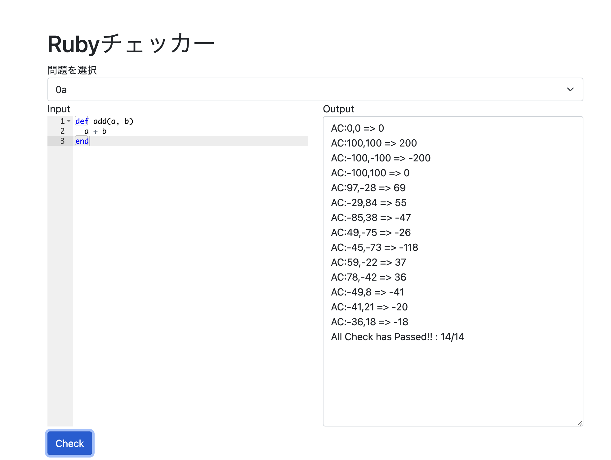

# 第1回 簡単な演算と関数

# このサイトの目的

Rubyによるプログラミングの基礎を学ぶ

## チェッカー

チェッカー：[https://rubylect.k1h.dev/checker](https://rubylect.k1h.dev/checker)

## 演習問題について

内容に基づいて毎回演習問題を用意します

**講習ではA〜Cの基礎的な問題を解説します**

Rubyを既に習った方や上級者向けに D〜F問題もありまので挑戦してみてください！

### 解けているかはチェッカーで判定します！

#### チェッカーの使い方

1. 左側に関数を入力
2. 問題番号を選択
3. Checkerを押す
4. **AC**と表示されればOK


## 本日の講習の流れ

### 1. Rubyについて

### 2. Rubyを触ってみる

### 3. 簡単な数値計算と関数

### 4. 演習+解説

# 1. Rubyについて
## まずプログラミングとは何か？

コンピューターに対して命令を記述して実行する
## Rubyとは？

- オブジェクト指向プログラミング言語
- まつもとゆきひろ(Matz)により開発
- 長年言語仕様が明文化されておらず、\
  MRI(CRuby)、JRuby、mrubyなど様々な実装がある
- Ruby on Rails, Gosu, DXRuby, GR-Citrusなど\
  Webアプリ開発からゲーム、マイコン制御まで幅広く
- 後期の基礎プログラミング及び演習で使う

# Rubyを触ってみる
## 環境構築チェック

事前に用意した第0回でA.B.Cのいずれかで構築 PowerShell or ターミナルで`irb`を入力

<hr>

Cの場合やまだ出来ていない場合は

[https://mame.github.io/emruby/irb/](https://mame.github.io/emruby/irb/)

などでやってみる

## irbとは?

**I**nteraction **R**u**b**y の略称 対話型でRubyで行えることを直接入力して試せる
## Hello World!

画面にHello Worldを表示する簡単なプログラム

古来から動作確認などに使われる伝統の儀式

```ruby
irb(main):001:0> puts("Hello World!")
Hello World!
=> nil
```

## 解説

```ruby
puts("Hello World!")
```

カッコ内の文字を出力する
"や'で囲われた文字は文字列として扱われる

ちなみに、
```ruby
puts "Hello World!"
```
のようにの代わりに空白でもOK

文字を出力する命令は他にもあって、
```ruby
p(オブジェクトを表示)
puts(改行あり)
print(改行なし)
```
ややこしい...


# 3. 簡単な数値計算と関数


## 変数

```ruby
irb(main):005:0> a=10
=> 10
irb(main):005:0> puts(a)
10
=> nil
```

数学の変数と同じで変数を定義して代入が可能


## 変数

```ruby
irb(main):005:0> a=10
=> 10
irb(main):005:0> a=3
=> 3
irb(main):005:0> puts(a)
3
=> nil
```

もう一度代入すると値が書き換わる


## 四則演算

```ruby
irb(main):008:0> a=3
=> 3
irb(main):009:0> b=4
=> 4
irb(main):012:0> a+b
=> 12
irb(main):012:0> a-b
=> -1
irb(main):012:0> a*b
=> 12
irb(main):012:0> a/b
=> 0
```


## 四則演算

```ruby
irb(main):012:0> 3/4
=> 0
```
のように整数同士の計算は整数になる

```ruby
irb(main):012:0> 3.0/4
=> 0.75
```
のように少数と整数だと結果は少数になる


## 四則演算


```ruby
irb(main):016:0> 3/0
(irb):16:in `/': divided by 0 (ZeroDivisionError)
	...
```

ゼロで割るとエラーが発生する(ゼロ除算)

必ず割り算では**0で割られないようにチェック**！


## 計算の規則

数学と同じく`*`や`/`が優先される

少数が含まれる計算の結果は少数
整数だけなら整数になる


## その他の計算

X**N: XをN乗した結果を出力
```ruby
3**2 => 9
```

X%N: XをNで割った余りを出力
```ruby
3%2 => 1
```


## 関数(メソッド)

```irb
irb> def add(a, b)
irb>   return a+b
irb> end
irb> puts(add(3, 4))
=> 7
```


## 関数(メソッド)

```irb
def add(a, b)
  return a+b
end
puts(add(3, 4))
```
数学と同じく与えられた変数(引数)に対して
値を返したり命令を実行する


# 演習


## 0a 動作確認

変数a,bに対してその和を出力する  
関数addを作成せよ

```
制作条件
-100 <= a,b <= 100
a,bはともにすべて整数
```


## 0a 動作確認

```ruby
def add(a, b)
  return (a+b)
end
```


## 実行環境の用意(ローカル)

適当なフォルダにtest.rbで保存
```bash
irb
irb(main):001:0> load 'add.rb'
=> true
irb(main):002:0> add(3,4)
=> 7
irb(main):003:0> 
```


### オンラインで実行する場合

paiza.io
mame.github.io/emruby

```ruby
def add(a, b)
  return (a+b)
end
puts(add(1,3))
```
などのようにして出力で確認


#### チェッカーで確認

1. 左側に関数を貼り付け
2. 問題番号0aを選択
3. Checkerを押す
4. **AC**と表示されればOK


## 演習問題1a

半径がrで高さはhの円錐の体積を求める関数vcornを作成せよ

```
制作条件
0.0<=r<=5.0
0.0<=h<=10.0
円周率はMath::PIを使用すること
```

Math::PIは変数と同じように使えます


<details markdown=block><summary><b>サンプルコード(押して開く)</b></summary>


```ruby
def vcorn(r, h)
  return Math::PI * r * r * h / 3.0
end
```


</details>

## 演習問題1b

m個の苺をn人で分けたときに1人あたり何個もらえて何個余るか出力する関数div(m,n)を作成せよ

```
制作条件
0<=m<=100, 0<n<=10
m,nは整数で結果は整数で返す
1人あたりa個もらえて余りがbならば、[a, b]の形で返す
```

return [a, b] のようにするとOK(これが何かは来週やります)

<details markdown=block><summary><b>サンプルコード(押して開く)</b></summary>

```ruby
def div(m, n)
  sol = m / n
  rem = m % n
  return [sol, rem]
end
```

</details>

## 演習問題1c

自然数a,b,cが与えられた時に

$$
\begin{align*}
ax^2+bx+c=0 (b^2-4ac\geq 0)
\end{align*}
$$

の解を出力する関数solve(a,b,c)を作成せよ

```
制作条件
0<a,b,c<=100
a,b,cは整数だが出力は少数で行う
2つの解を[a, b]のようにして出力し重解の場合は同じ値を返す
ルートの計算にはMath.sqrt(x)関数を使用してください
```


<details markdown=block><summary><b>サンプルコード(押して開く)</b></summary>

```ruby
def solve(a, b, c)
  x1 = (-b + Math.sqrt(b ** 2 - 4 * a * c)) / (2 * a)
  x2 = (-b - Math.sqrt(b ** 2 - 4 * a * c)) / (2 * a)
  return [x1, x2]
end
```

**講習の際の解答に誤りがありました。申し訳ありません。**

`-b + Math.sqrt(b ** 2 - 4 * a * c)/(2*a)`のようになっていたのですが、掛け算の方が先に計算されるため誤った解答になります。そのため、分子を先に計算するために括弧を追加しました。

チェッカーのテストケースも誤っていたため修正いたしました。

</details>

# 以下上級者向け問題

以下はすべて今回の内容で扱った範囲内で解くことが可能です  
そのため、問題文で指定されている場合を除いて変数の定義・代入、演算以外の操作は行ないません

## 演習問題1d

与えられた自然数aについてa番目の素数を出力するプログラムを作成せよ

```
制作条件
1<=a<=10
aは整数
aの絶対値を出力するa.absは使用可能です
```

<details markdown=block><summary><b>サンプルコード(押して開く)</b></summary>

```ruby
def sosu(a)
  2 + (((a - 1.5) + ((a - 1.5).abs)) / (a * 2 - 3) * 1) + (((a - 2.5) + ((a - 2.5).abs)) / (a * 2 - 5) * 2) + (((a - 3.5) + ((a - 3.5).abs)) / (a * 2 - 7) * 2) + (((a - 4.5) + ((a - 4.5).abs)) / (a * 2 - 9) * 4) + (((a - 5.5) + ((a - 5.5).abs)) / (a * 2 - 11) * 2) + (((a - 6.5) + ((a - 6.5).abs)) / (a * 2 - 13) * 4) + (((a - 7.5) + ((a - 7.5).abs)) / (a * 2 - 15) * 2) + (((a - 8.5) + ((a - 8.5).abs)) / (a * 2 - 17) * 4) + (((a - 9.5) + ((a - 9.5).abs)) / (a * 2 - 19) * 6)
end
```

</details>